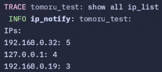

# IP Request Counter

A simple HTTP server that tracks and displays real-time IP address statistics for incoming requests.

## Features

- Real-time IP address request counting
- Periodic statistics display (every second)
- RESTful endpoint `/ping`
- Graceful shutdown support
- Configurable logging levels

## Configuration

Environment variables (can be set via `.env` file):
- `HOST`: Server host (default: "0.0.0.0")
- `PORT`: Server port (default: "8081")
- `LOG_LEVEL`: Logging level (default: "INFO")

## Usage

1. Clone the repository
2. Set up environment variables (optional)
3. Run the server:
```bash
cargo run
```

The server will display IP statistics every second, showing the number of requests from each IP address sorted by frequency.

## Endpoints

- `GET /ping`: Returns "pong" (health check endpoint)

## Showcase


## License

[MIT](Readme.md)
